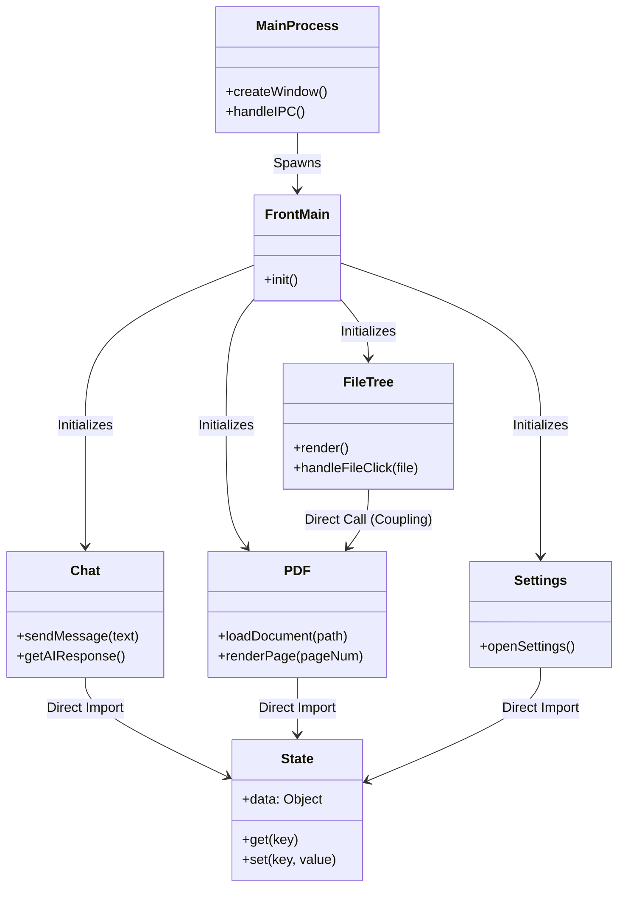
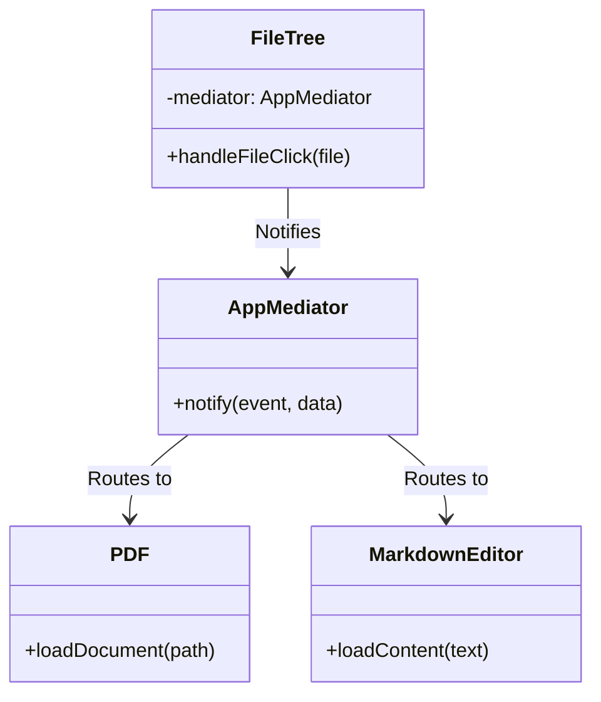
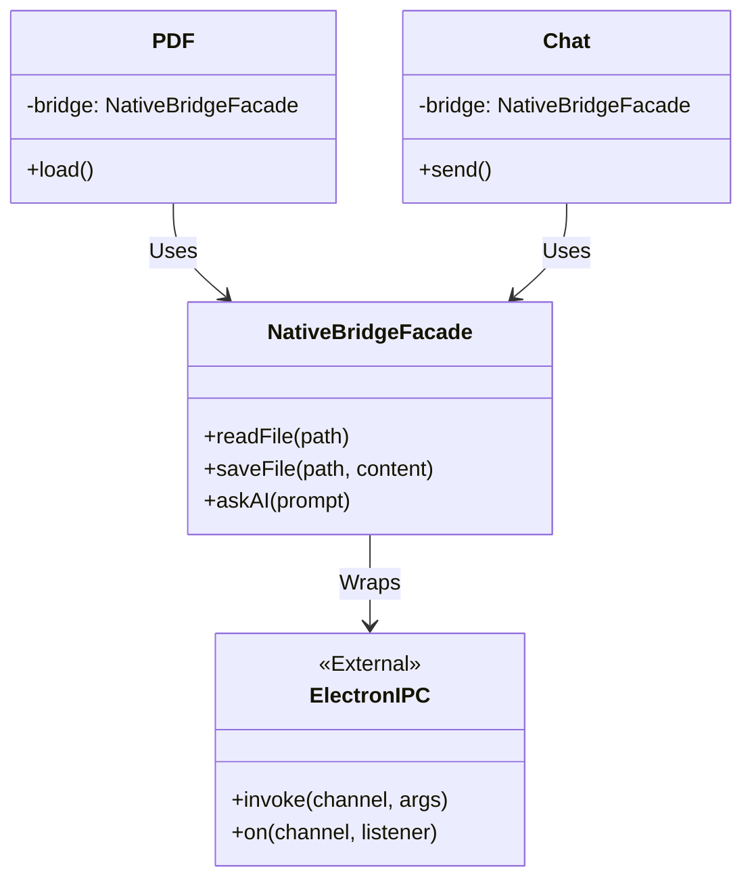
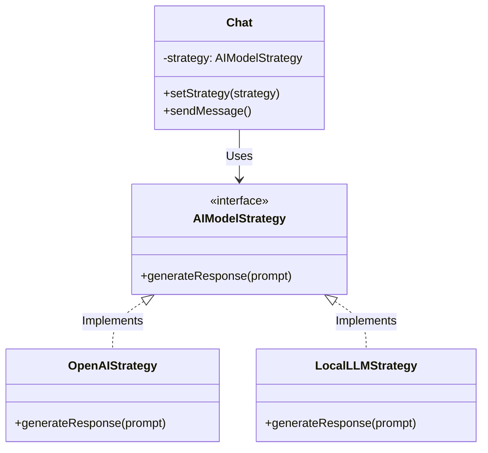

# Assignment 4: Pattern for Maintenance
**Student ID:** ColbyFrison  
**Course:** CS4213 Design Patterns  
**Date:** Fall 2025  

---

## Task A: Select a Design to Refactor

### 1. System Overview: SmartWrite
**SmartWrite** is an electron-based application designed to digitize and organize notes. It combines a local backend (Electron Main Process) for system access with a web-based frontend (Renderer Process) for the user interface. 

**Purpose:**  
To provide a seamless interface for viewing PDFs, editing Markdown notes, and interacting with an AI assistant for content analysis, all within a unified local environment.

### 2. Current Design Flaws
While the application functions correctly, several design choices hinder maintenance and scalability:

1.  **High Coupling (Flexibility Issue):**
    *   The `FileTree` module handles file selection logic but is tightly coupled to the `PDF` module. When a file is clicked, `FileTree` directly invokes `PDF.loadDocument()`. This makes it difficult to add new file viewers (e.g., for images or pure text) without modifying the `FileTree` class.
    *   Modules often import each other directly rather than communicating through abstractions.

2.  **God Object / Orchestration Complexity (Reuse Issue):**
    *   The `FrontMain` (Frontend `main.js`) acts as a central orchestrator that manually initializes every module (`Chat`, `PDF`, `Settings`, etc.). This makes `FrontMain` a "God Class" that knows too much about the specific implementation of every feature, making it hard to reuse individual modules in other contexts without dragging in the entire initialization logic.

3.  **Testability Issues:**
    *   **Global State dependencies:** Most modules (like `Chat` and `Theme`) directly import a singleton `State` object. This global dependency makes unit testing difficult because the state persists between tests unless manually reset, and mocking the state requires complex module interception.
    *   **DOM Coupling:** Business logic (e.g., parsing PDF text) is intertwined with UI manipulation (e.g., updating the DOM), making it impossible to test logic without a browser environment.

### 3. Original UML Class Diagram
The current design relies on direct relationships and a central orchestrator.

---

## Task B: Refactor for Flexibility and Reuse

### Refactoring 1: Mediator Pattern (Flexibility)
**Goal:** Decouple the `FileTree` from specific file viewers like `PDF`.

**Description:**  
Currently, `FileTree` explicitly calls `PDF.loadDocument()` when a user selects a file. To decouple these components, we will introduce an **AppMediator**.
1.  The `FileTree` will no longer import `PDF`. Instead, it will notify the Mediator (e.g., `mediator.notify('fileSelected', file)`) when a user interacts with the UI.
2.  The `AppMediator` holds references to `PDF`, `FileTree`, and other potential modules (like a future `MarkdownEditor`).
3.  When the Mediator receives the `fileSelected` event, it checks the file extension and routes the request to the appropriate module (e.g., calling `PDF.loadDocument()` only if the file is a PDF).

**Updated UML Snippet:**

### Refactoring 2: Facade Pattern (Reuse)
**Goal:** Consolidate native system interactions to promote code reuse and simplify the frontend.

**Description:**  
The application heavily relies on Electron's IPC (Inter-Process Communication) via `window.electron` exposed by the preload script. Currently, raw IPC calls like `ipcRenderer.invoke('read-file', path)` are scattered across `PDF.js`, `FileTree.js`, and `Chat.js`.
We will implement a **NativeBridgeFacade**.
1.  This Facade will provide a clean, simplified interface for all system operations: `readFile(path)`, `savePreferences(data)`, `fetchAIResponse(prompt)`.
2.  The individual modules will depend on `NativeBridgeFacade` instead of the global Electron object.
3.  This improves reuse: if we port the app to the web (removing Electron), we only need to replace `NativeBridgeFacade` with a `WebBridgeFacade`, without changing the business logic in `Chat` or `PDF`.

**Updated UML Snippet:**

### Refactoring 3: Strategy Pattern (Design Needs)
**Goal:** Allow runtime switching between different AI models (e.g., OpenAI vs. Local LLM).

**Description:**  
The `Chat` module currently hardcodes the interaction with a specific AI provider. We will extract this logic into an **AIModelStrategy** interface.
1.  Define an interface `AIModelStrategy` with a method `generateResponse(prompt)`.
2.  Create concrete implementations: `OpenAIStrategy` (calls external API) and `LocalLLMStrategy` (calls local Python process or Ollama).
3.  The `Chat` module will hold a reference to the current strategy and delegate the generation call. This allows the user to switch providers in Settings without rewriting `Chat.js`.

**Updated UML Snippet:**

---

## Task C: Refactor for Testability + Tools

### 1. Refactoring for Testability

**Refactoring A: Dependency Injection (DI)**  
Currently, modules like `Chat` import the global `State` singleton directly. This makes testing hard because state persists across tests.
*   **Change**: Modify `Chat` and `PDF` constructors to accept dependencies (`state`, `bridge`) as arguments.
*   **Benefit**: In unit tests, we can inject a `MockState` or `MockBridge`. This ensures that a test for `Chat` doesn't accidentally fail because of unrelated data left over in the real `State` object.

**Refactoring B: Logic Isolation (Humble Object Pattern)**  
The `PDF` module mixes complex logic (text extraction, search algorithms) with DOM manipulation (rendering to Canvas).
*   **Change**: Extract the pure logic into a `PDFProcessor` class (handles parsing, text analysis) and keep the UI code in `PDFViewer`.
*   **Benefit**: We can write fast, headless unit tests for `PDFProcessor` using Jest/Node.js without needing a browser environment or complex DOM mocks.

### 2. Tool Research: Jest (JavaScript Testing Framework)

**Key Features:**
*   **Mocking Capabilities**: Jest allows easy mocking of imports (e.g., mocking `fs` or `electron`) to isolate the unit under test.
*   **Snapshot Testing**: Automatically saves the output of a component (e.g., the structure of a generated file tree) and warns if it changes unexpectedly.
*   **Code Coverage**: Built-in reports show which lines of code are not covered by tests, highlighting risky areas.

**Safe Refactoring with Jest:**
Jest is crucial for safe refactoring through **Regression Testing**. 
1.  Before applying the Mediator pattern, we would write a test suite that asserts "When File A is clicked, PDF Viewer loads File A". 
2.  We refactor the code to use `AppMediator`.
3.  We run the test again. If it passes, we know the external behavior is preserved despite the internal structural change.

---

## Task D: Reflection on Refactoring Impact

**Summary:**
The refactoring that had the **greatest impact** was the **Mediator Pattern**.

Prior to this change, the `FileTree` had to "know" about every possible file viewer in the system. If I wanted to add an Image Viewer, I would have to modify the `FileTree` code to say `if (file.ext == 'png') ImageViewer.load()`. This violation of the Open/Closed Principle meant that adding features required modifying existing, stable code, risking bugs in the file selection logic.

By introducing the `AppMediator`, the `FileTree` became purely a "notifier". It says "someone clicked a file" and stops caring. The Mediator handles the complexity. This shifted the system from a brittle mesh of point-to-point connections to a clean, centralized event handling architecture.

This experience changed my view of design improvement from "making code cleaner" to "making code **changeable**". The value wasn't just in the lines of code saved, but in the hours of future debugging saved by decoupling components.
